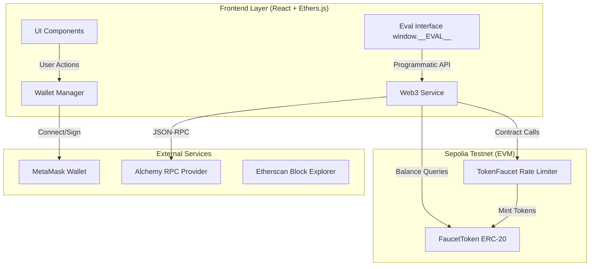

# ERC-20 Token Faucet DApp

A complete decentralized application for distributing ERC-20 tokens with on-chain rate limiting. Built with Solidity, Hardhat, React, Ethers.js, and Docker.

## Overview

This DApp implements a token distribution system where users can claim free ERC-20 tokens on the Sepolia testnet. The faucet enforces:

- 24-hour cooldown between consecutive claims per address
- Lifetime maximum of 100 FCT per Ethereum address
- Admin-controlled pause functionality for emergency stops

All rules are enforced on-chain, making them trustless and immutable without requiring a centralized authority.

## Architecture



## Deployed Contracts (Sepolia Testnet)

| Contract | Address | Etherscan | Verified |
|---|---|---|---|
| Token (FCT) | `0xb822418aEfE7C0eb71a3E75972fCBb9121662Fc4` | [View](https://sepolia.etherscan.io/address/0xb822418aEfE7C0eb71a3E75972fCBb9121662Fc4) | Yes |
| TokenFaucet | `0x42cBFd60e3bD5c825627e1cf48899d23617ADd4B` | [View](https://sepolia.etherscan.io/address/0x42cBFd60e3bD5c825627e1cf48899d23617ADd4B) | Yes |

Network: Sepolia (Chain ID: 11155111)

## Screenshots

### Wallet Connection Interface


### Connected Wallet Dashboard


### MetaMask Transaction Confirmation


### Successful Token Claim


### Cooldown Timer (Error State)


### Etherscan Verification


## Quick Start

```bash
git clone https://github.com/Rushikesh-5706/ERC-20-Token-Faucet-DApp.git
cd ERC-20-Token-Faucet-DApp
cp .env.example .env
# Edit .env and fill in VITE_RPC_URL, VITE_TOKEN_ADDRESS, VITE_FAUCET_ADDRESS
docker compose up
# Open http://localhost:3000
```

## Configuration

| Variable | Description |
|---|---|
| SEPOLIA_RPC_URL | Alchemy or Infura Sepolia endpoint |
| PRIVATE_KEY | Deployer wallet private key (never commit this) |
| ETHERSCAN_API_KEY | For contract source code verification |
| VITE_RPC_URL | RPC URL for the frontend (same as SEPOLIA_RPC_URL) |
| VITE_TOKEN_ADDRESS | Deployed Token contract address |
| VITE_FAUCET_ADDRESS | Deployed Faucet contract address |

## Design Decisions

**Faucet amount: 10 FCT per claim.** Provides a meaningful quantity for testing while keeping the lifetime limit reachable in a reasonable number of visits. With 18 decimals this is 10 * 10^18 base units.

**Cooldown: 24 hours.** Standard practice for testnet faucets. Prevents automated scripts from draining supply while still allowing genuine daily testing.

**Lifetime limit: 100 FCT.** Ten claims maximum per address. Encourages fair distribution across testers and prevents single-address monopolization. Determined users can generate new addresses, which is acknowledged as a known limitation.

**Total supply: 100 million FCT.** Large enough to support extensive testnet use cases — sufficient for approximately one million unique claimers at the lifetime maximum.

## Testing

```bash
npm install
npx hardhat test
```

Test coverage includes: ERC-20 standard compliance, first-time claim, cooldown enforcement with time manipulation (hardhat-network-helpers), cooldown revert message accuracy, lifetime limit enforcement and revert message, pause/unpause access control, FaucetPaused event emission, TokensClaimed event emission, Transfer event on mint and transfer, multiple independent users, and reentrancy protection verification.

## Security Considerations

The contracts implement several layers of protection. Reentrancy is prevented by OpenZeppelin's ReentrancyGuard applied to requestTokens(), and additionally by updating all state variables before calling token.mint() (checks-effects-interactions pattern). Minting is restricted to a single authorized address set by the token owner. Only the faucet deployer can pause or unpause via the Ownable pattern from OpenZeppelin. Solidity 0.8.20 provides built-in integer overflow protection. Zero-address checks are applied to all address parameters.

For a production deployment, the admin key should be replaced with a multisig wallet, and a timelock should be added to critical admin functions.

## Known Limitations

- Single network: configured for Sepolia only, requires code changes for other networks.
- MetaMask dependency: only EIP-1193 compatible wallets are supported. No WalletConnect.
- Sybil resistance: per-address limits cannot prevent users from creating multiple wallets.
- Gas requirement: users must hold Sepolia ETH to pay for claim transactions.
- Frontend state is not persisted across page refreshes; reconnection is required.

## Evaluation Interface

The application exposes window.__EVAL__ for automated testing:

```javascript
await window.__EVAL__.connectWallet()          // returns address string
await window.__EVAL__.requestTokens()          // returns tx hash string
await window.__EVAL__.getBalance("0x...")      // returns balance string in base units
await window.__EVAL__.canClaim("0x...")        // returns boolean
await window.__EVAL__.getRemainingAllowance("0x...") // returns allowance string
await window.__EVAL__.getContractAddresses()   // returns { token, faucet }
```
