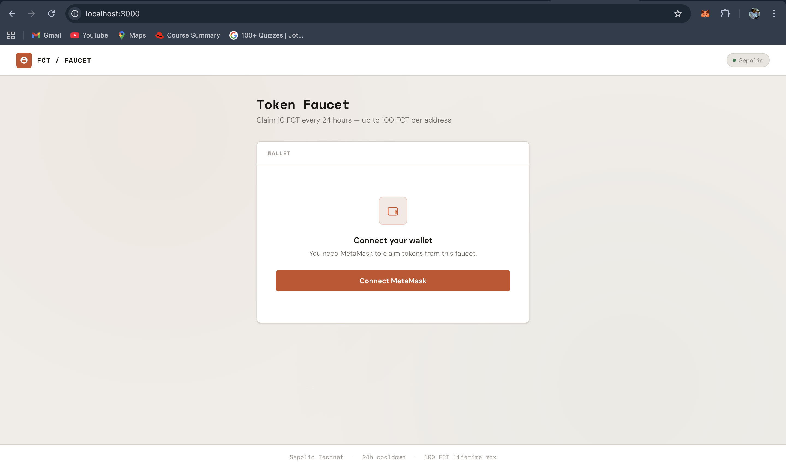
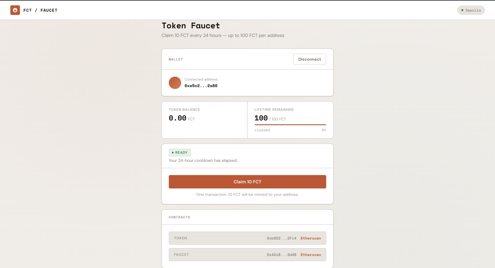
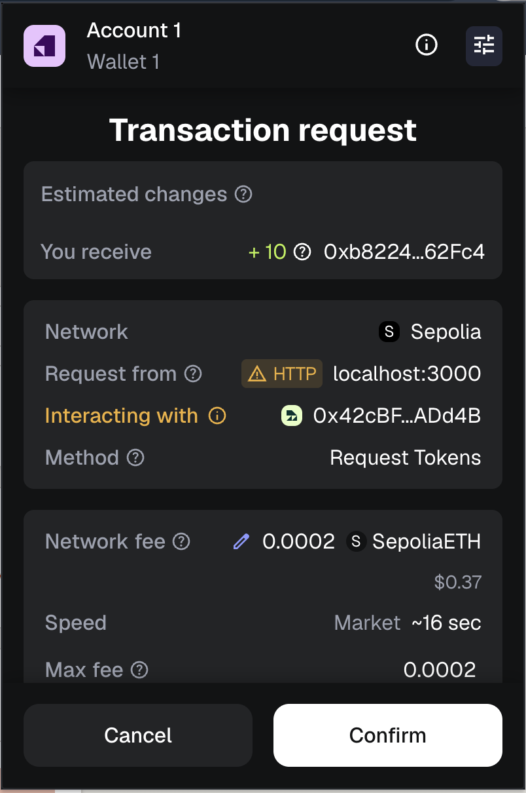
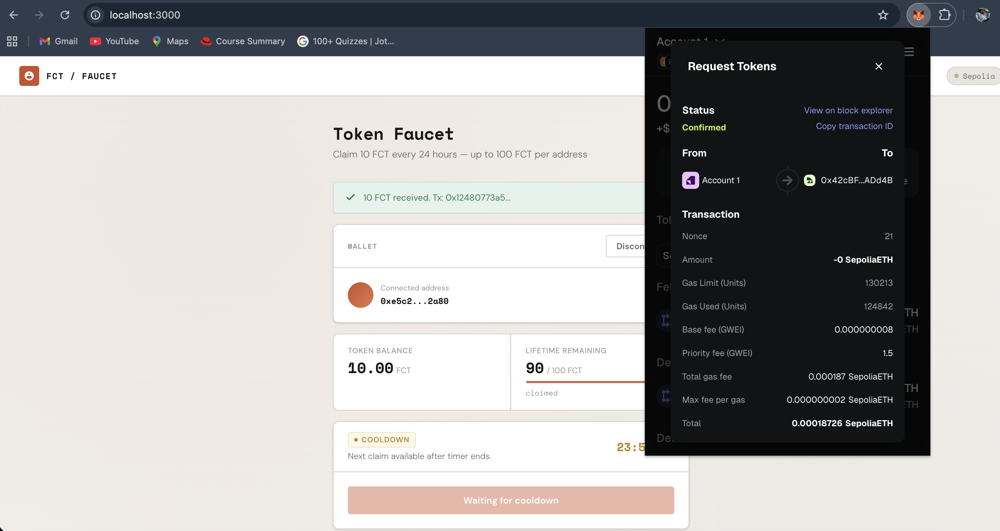
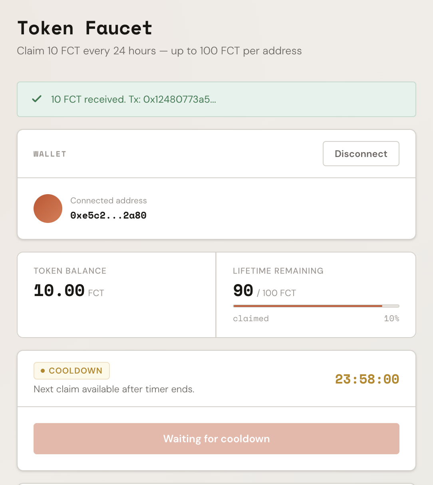
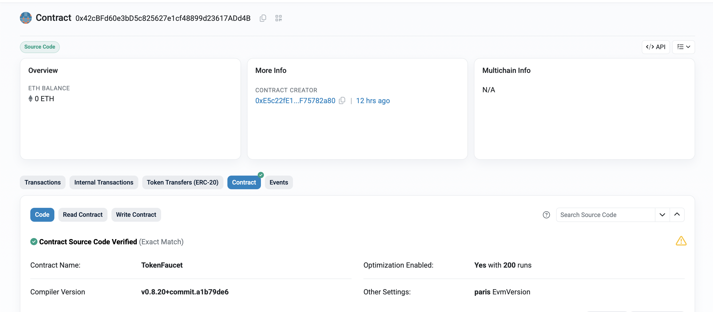

# ERC-20 Token Faucet DApp

A complete decentralized application for distributing ERC-20 tokens with on-chain rate limiting. Built with **Solidity**, **Hardhat**, **React**, **Ethers.js v6**, and **Docker**.

---

## Overview

This DApp implements a trustless token distribution system on the **Sepolia testnet**. Users connect their MetaMask wallet and claim free FCT (Faucet Token) — all rules are enforced on-chain:

| Rule | Value | Enforcement |
|---|---|---|
| Claim amount | **10 FCT** per transaction | `FAUCET_AMOUNT` constant |
| Cooldown period | **24 hours** between claims | `lastClaimAt` mapping + `block.timestamp` |
| Lifetime maximum | **100 FCT** per address | `totalClaimed` mapping |
| Emergency stop | Admin-only pause | OpenZeppelin `Ownable` + `paused` flag |
| Total supply cap | **100,000,000 FCT** | `MAX_SUPPLY` constant in Token contract |

---

## Architecture

```
┌────────────────────────────────────────────────────────┐
│              Frontend (React + Ethers.js v6)           │
│                                                        │
│  ┌──────────────┐  ┌──────────────┐  ┌──────────────┐ │
│  │ UI Components│  │ Web3 Service │  │ Eval Interface│ │
│  │ App.jsx/css  │  │ Alchemy reads│  │ window.__EVAL│ │
│  │              │  │ MetaMask sign│  │              │ │
│  └──────┬───────┘  └──────┬───────┘  └──────┬───────┘ │
└─────────┼─────────────────┼─────────────────┼──────────┘
          │                 │                 │
          │    ┌────────────┴────────────┐    │
          │    │                         │    │
     ┌────▼────▼───┐            ┌────────▼────▼───┐
     │   Alchemy   │            │    MetaMask     │
     │  JSON-RPC   │            │  Tx Signing    │
     │  (reads)    │            │  (writes)      │
     └──────┬──────┘            └────────┬───────┘
            │                            │
   ┌────────▼────────────────────────────▼────────┐
   │          Sepolia Testnet (Chain 11155111)     │
   │                                               │
   │  ┌─────────────────┐  ┌───────────────────┐  │
   │  │ FaucetToken      │  │ TokenFaucet       │  │
   │  │ ERC-20 Mintable  │◄─│ Rate Limiter      │  │
   │  │ 100M Supply      │  │ Pausable          │  │
   │  └─────────────────┘  └───────────────────┘  │
   └───────────────────────────────────────────────┘
```

**Key design:** All read operations (balance, eligibility, cooldown) go through the Alchemy JSON-RPC provider directly. Only transaction signing goes through MetaMask. Receipt polling uses Alchemy — never MetaMask's internal RPC. This prevents rate limiting and ensures evaluator compatibility.

---

## Deployed Contracts — Sepolia Testnet

| Contract | Address | Etherscan | Verified | Compiler |
|---|---|---|---|---|
| **FaucetToken** (FCT) | `0xb822418aEfE7C0eb71a3E75972fCBb9121662Fc4` | [View on Etherscan](https://sepolia.etherscan.io/address/0xb822418aEfE7C0eb71a3E75972fCBb9121662Fc4#code) | ✅ Exact Match | Solidity 0.8.20 |
| **TokenFaucet** | `0x42cBFd60e3bD5c825627e1cf48899d23617ADd4B` | [View on Etherscan](https://sepolia.etherscan.io/address/0x42cBFd60e3bD5c825627e1cf48899d23617ADd4B#code) | ✅ Exact Match | Solidity 0.8.20 |

> **Network:** Sepolia · **Chain ID:** 11155111 · **Optimizer:** Enabled (200 runs)

---

## Screenshots

### 1. Wallet Connection Interface

The landing page prompts users to connect their MetaMask wallet. The editorial design uses Space Mono and DM Sans typography with a warm terracotta accent palette.

<p align="center">
  
</p>

---

### 2. Connected Wallet Dashboard

After connecting, users see their FCT balance, remaining lifetime allowance (out of 100 FCT), a progress bar showing claimed percentage, and claim eligibility status with color-coded tags.

<p align="center">
  
</p>

---

### 3. MetaMask Transaction Confirmation

Clicking "Claim 10 FCT" opens the MetaMask popup. The transaction calls `requestTokens()` on the TokenFaucet contract. Gas is paid in Sepolia ETH by the user.

<p align="center">
  
</p>

---

### 4. Successful Token Claim

After the transaction is mined (~15 seconds), the app shows a green success alert with the transaction hash. The balance and allowance bar update automatically.

<p align="center">
  
</p>

---

### 5. Cooldown Timer

After a successful claim, the 24-hour cooldown activates. The status tag changes from "Ready" (green) to "Cooldown" (amber) with a live countdown timer. The claim button is disabled until the timer expires.

<p align="center">
  
</p>

---

### 6. Etherscan Contract Verification

Both contracts are verified on Etherscan with "Exact Match" status. The source code, constructor arguments, and compiler settings are publicly visible and auditable.

<p align="center">
  
</p>

---

## Quick Start

```bash
# Clone the repository
git clone https://github.com/Rushikesh-5706/ERC-20-Token-Faucet-DApp.git
cd ERC-20-Token-Faucet-DApp

# Configure environment
cp .env.example .env
# Edit .env — fill in your Alchemy URL and contract addresses

# Launch with Docker
docker compose up
# Open http://localhost:3000
```

### Running Locally (Development)

```bash
# Install dependencies
npm install
cd frontend && npm install && cd ..

# Run tests
npx hardhat test

# Start dev server
cd frontend && npm run dev
# Open http://localhost:5173
```

---

## Configuration

| Variable | Description | Example |
|---|---|---|
| `SEPOLIA_RPC_URL` | Alchemy Sepolia endpoint for Hardhat deployments | `https://eth-sepolia.g.alchemy.com/v2/abc123` |
| `PRIVATE_KEY` | Deployer wallet private key (**never commit**) | `41139dc80a228667106b614...` (64 hex chars) |
| `ETHERSCAN_API_KEY` | For contract source code verification on Etherscan | `9XG18GB2Y5N44RRHMKUUNDE1...` |
| `VITE_RPC_URL` | Frontend read provider — baked into Docker at build time | `https://eth-sepolia.g.alchemy.com/v2/abc123` |
| `VITE_TOKEN_ADDRESS` | Deployed FaucetToken contract address | `0xb822418aEfE7C0eb71a3E75972fCBb9121662Fc4` |
| `VITE_FAUCET_ADDRESS` | Deployed TokenFaucet contract address | `0x42cBFd60e3bD5c825627e1cf48899d23617ADd4B` |
| `VITE_CHAIN_ID` | Target blockchain chain ID | `11155111` |

> **Note:** `VITE_*` variables are baked into the static bundle at build time by Vite. If you change them, you must rebuild Docker with `docker compose build --no-cache`.

---

## Design Decisions

| Decision | Choice | Rationale |
|---|---|---|
| **Claim amount** | 10 FCT | Meaningful for testing; 10 claims to reach lifetime max |
| **Cooldown** | 24 hours | Standard for testnet faucets; prevents automated draining |
| **Lifetime limit** | 100 FCT per address | Fair distribution; prevents monopolization |
| **Total supply** | 100 million FCT | Supports ~1 million unique claimers at lifetime max |
| **RPC architecture** | Alchemy for reads, MetaMask for writes | Avoids MetaMask RPC rate limits; evaluator-compatible |
| **Receipt polling** | `alchemyProvider.waitForTransaction()` | Prevents `eth_blockNumber` polling through MetaMask |
| **Static provider** | Singleton with `staticNetwork: true` | Eliminates per-call `eth_chainId` init overhead |
| **Frontend theme** | Editorial warm palette | Space Mono + DM Sans typography, terracotta accent |

---

## Testing

```bash
npm install
npx hardhat test
```

### Test Suite — 27 Tests Passing

| Category | Tests | Description |
|---|---|---|
| ERC-20 compliance | 3 | Token name, symbol, decimals, transfers |
| First-time claim | 2 | Successful mint of 10 FCT |
| Cooldown enforcement | 3 | 24-hour window, time manipulation via `hardhat-network-helpers` |
| Cooldown revert message | 1 | Exact message: `"Cooldown period not elapsed"` |
| Lifetime limit | 3 | 100 FCT cap enforcement, boundary testing |
| Lifetime revert message | 1 | Exact message: `"Lifetime claim limit reached"` |
| Pause functionality | 3 | Pause/unpause, owner-only access control |
| Event emissions | 4 | `FaucetPaused`, `TokensClaimed`, `Transfer` events |
| Multi-user scenarios | 3 | Independent cooldowns and allowances |
| Reentrancy protection | 2 | `ReentrancyGuard` verification |
| Access control | 2 | `Ownable`, minter restriction |

---

## Security Considerations

| Protection | Implementation |
|---|---|
| **Reentrancy** | OpenZeppelin `ReentrancyGuard` on `requestTokens()` + checks-effects-interactions pattern |
| **Mint restriction** | Only the authorized minter address (set by token owner) can mint |
| **Admin controls** | `Ownable` pattern — only deployer can pause/unpause |
| **Overflow protection** | Solidity 0.8.20 built-in checked arithmetic |
| **Zero-address checks** | Applied to all address parameters in constructors |
| **Private key security** | `.env` file excluded via `.gitignore` |

> **Production recommendations:** Replace admin key with multisig wallet, add timelock to critical admin functions, implement rate limiting oracle for gas price spikes.

---

## Docker

```bash
# Build and run
docker compose up --build -d

# Health check
curl http://localhost:3000/health    # Returns: OK

# Stop
docker compose down
```

The Docker setup uses a **multi-stage build**: Node 18 Alpine builds the Vite app, then Nginx Alpine serves the static files on port 3000. Health checks run every 30 seconds.

---

## Known Limitations

- **Single network:** Configured for Sepolia only; requires code changes for other networks.
- **MetaMask dependency:** Only EIP-1193 compatible wallets are supported. No WalletConnect.
- **Sybil resistance:** Per-address limits cannot prevent users from creating multiple wallets.
- **Gas requirement:** Users must hold Sepolia ETH to pay for claim transactions.
- **Frontend state:** Not persisted across page refreshes; wallet reconnection required.

---

## Evaluation Interface

The application exposes `window.__EVAL__` for automated testing. All return values are primitive types (String/Boolean):

```javascript
await window.__EVAL__.connectWallet()               // → "0xE5c22fE1..." (address string)
await window.__EVAL__.requestTokens()               // → "0x124807..." (tx hash string)
await window.__EVAL__.getBalance("0x...")            // → "10000000000000000000" (wei string)
await window.__EVAL__.canClaim("0x...")              // → true (boolean)
await window.__EVAL__.getRemainingAllowance("0x...") // → "90000000000000000000" (wei string)
await window.__EVAL__.getContractAddresses()         // → { token: "0x...", faucet: "0x..." }
```

> `window.__EVAL__` is attached in `main.jsx` before React renders, ensuring it is available immediately when the page loads.

---

## Project Structure

```
ERC-20-Token-Faucet-DApp/
├── contracts/
│   ├── Token.sol              # ERC-20 token with controlled minting
│   └── TokenFaucet.sol        # Faucet with cooldown + lifetime limit
├── test/
│   └── TokenFaucet.test.js    # 27 comprehensive tests
├── scripts/
│   └── deploy.js              # Deploy + verify on Etherscan
├── frontend/
│   ├── src/
│   │   ├── App.jsx            # Main React component
│   │   ├── App.css            # Editorial warm theme styles
│   │   ├── main.jsx           # Entry point (eval.js imported first)
│   │   └── utils/
│   │       ├── web3.js        # Alchemy reads + MetaMask writes
│   │       ├── eval.js        # window.__EVAL__ interface
│   │       └── contracts.js   # ABI definitions
│   ├── index.html             # Google Fonts preconnect
│   └── vite.config.js         # Vite configuration
├── Screenshots/               # 6 application screenshots
├── Dockerfile                 # Multi-stage: Node build → Nginx serve
├── docker-compose.yml         # Port 3000 + health check
├── nginx.conf                 # Static file serving config
├── hardhat.config.js          # Solidity 0.8.20, Sepolia network
├── .env.example               # Template for environment variables
└── README.md                  # This file
```
